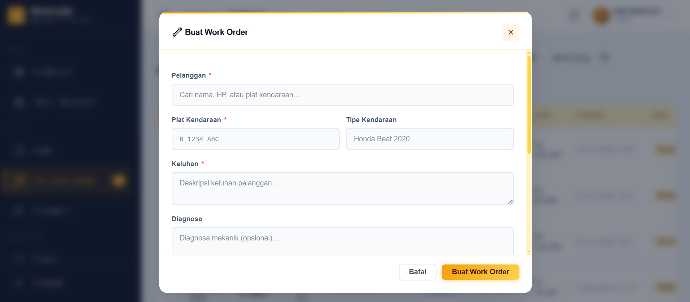
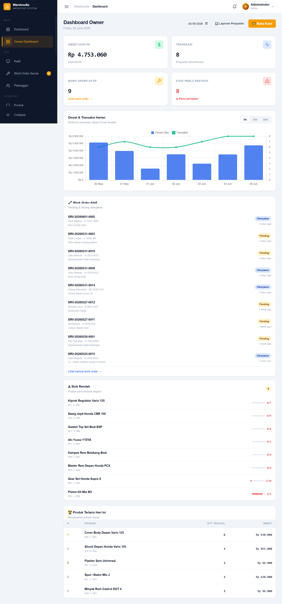
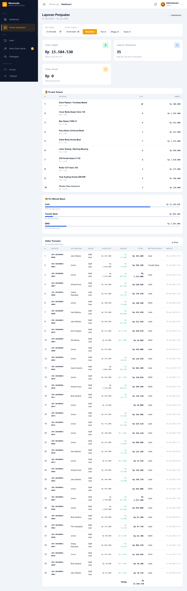

# WarehouSe — Inventory & POS System untuk Bengkel

<div align="center">


**Sistem manajemen inventaris + POS lengkap untuk bengkel motor/mobil.**
Dari stok spare part, kasir, work order servis, hingga laporan harian owner — semua dalam satu aplikasi.

[Demo](#-demo-akun) · [Fitur](#-fitur) · [Instalasi](#%EF%B8%8F-instalasi) · [Struktur](#-struktur-project)

</div>

---

## 📸 Screenshot

| Kasir POS | Work Order Servis |
|:---------:|:-----------------:|
| .PNG) |  |
| Grid produk + keranjang real-time | Form WO + spare part + update status |

| Owner Dashboard | Laporan Penjualan |
|:---------------:|:-----------------:|
|  |  |
| Omzet harian + grafik + WO aktif | Filter tanggal + breakdown metode bayar |

---

## ✨ Fitur

### 🏪 POS Kasir
- Grid produk dengan search live (nama / SKU)
- Keranjang belanja dengan qty control
- Split payment (cash + transfer + QRIS sekaligus)
- Hitung kembalian otomatis untuk pembayaran cash
- Cetak struk thermal 80mm (popup window, tidak bergantung DOM)
- Tab riwayat transaksi dengan filter tanggal + cetak ulang struk

### 🔧 Work Order Servis
- Buat work order dengan search pelanggan (nama / HP / plat)
- Tambah spare part ke WO dengan search live + tampil stok tersedia
- Update status dengan validasi transisi: `pending → in_progress → done / cancelled`
- Saat status `done`: stok spare part otomatis berkurang + tercatat di `stock_movements`
- Detail WO: keluhan, diagnosa, spare part yang dipakai, estimasi total

### 👥 Manajemen Pelanggan
- CRUD pelanggan dengan data kendaraan (plat + tipe)
- Search by nama, nomor HP, atau plat kendaraan
- Riwayat servis & transaksi per pelanggan

### 📦 Inventory
- Manajemen produk dengan kategori & supplier
- Stock in / stock out manual
- Audit log lengkap di `stock_movements`
- Alert produk di bawah `min_stock`

### 📊 Dashboard Owner *(mobile-friendly)*
- Stat cards harian: omzet, jumlah transaksi, WO aktif, stok rendah
- Date picker — cek laporan hari lain tanpa reload
- Grafik omzet + transaksi dual-axis (7 / 14 / 30 hari)
- Daftar work order aktif (pending & in_progress)
- Produk terlaris hari ini

### 📋 Laporan Penjualan
- Filter rentang tanggal + shortcut (hari ini / minggu ini / bulan ini)
- Breakdown per metode pembayaran dengan progress bar
- Top 10 produk terlaris periode tersebut
- Tabel transaksi lengkap dengan total
- Print-friendly CSS

### 👤 User Management
- Role: `owner`, `admin`, `staff`
- Owner: akses dashboard + laporan
- Admin: semua fitur + cancel transaksi + manajemen user
- Staff: kasir + work order + stok

---

## 🎭 Demo Akun

Setelah menjalankan seeder (`php artisan db:seed --class=PosSeeder`):

| Role | Email | Password |
|------|-------|----------|
| Owner | `owner@warehouse.test` | `password` |
| Admin | `admin@warehouse.test` | `password` |
| Staff | `staff@warehouse.test` | `password` |

> Seeder mengisi ±10 pelanggan, 15 work order berbagai status, dan ±80 transaksi penjualan 14 hari terakhir.

---

## 🛠️ Tech Stack

| Layer | Teknologi |
|-------|-----------|
| Backend | Laravel 12, PHP 8.2+ |
| Frontend | Alpine.js 3, Tailwind CSS v4 |
| Database | PostgreSQL 15+ |
| Charts | Chart.js |
| Build | Vite |

---

## ⚙️ Instalasi

### Persyaratan Sistem

- PHP >= 8.2
- Composer
- Node.js >= 18 & NPM
- PostgreSQL >= 15
- Git

### Langkah Instalasi

**1. Clone repository**

```bash
git clone https://github.com/sulistiyas/Inventory-Management.git
cd Inventory-Management
```

**2. Install dependency**

```bash
composer install
npm install
```

**3. Setup environment**

```bash
cp .env.example .env
php artisan key:generate
```

**4. Konfigurasi database di `.env`**

```env
DB_CONNECTION=pgsql
DB_HOST=127.0.0.1
DB_PORT=5432
DB_DATABASE=warehouse_db
DB_USERNAME=your_username
DB_PASSWORD=your_password
```

**5. Migrasi & seed database**

```bash
# Migrasi semua tabel (termasuk modul POS)
php artisan migrate

# Seed data awal (kategori, supplier, produk, user)
php artisan db:seed

# Seed data demo POS (pelanggan, work order, transaksi)
php artisan db:seed --class=PosSeeder
```

**6. Build assets**

```bash
# Production
npm run build

# Development (hot reload)
npm run dev
```

**7. Jalankan server**

```bash
php artisan serve
```

Akses di: **http://127.0.0.1:8000**

---

## 🗄️ Struktur Database

### Tabel Inti (Inventory)

```
users               — Auth + role (owner / admin / staff)
categories          — Kategori produk
suppliers           — Data supplier
products            — Produk + stok + min_stock + cost_price
stock_movements     — Audit log semua perubahan stok
```

### Tabel POS

```
customers           — Data pelanggan + kendaraan (plat, tipe)
payment_methods     — Master metode bayar (cash / transfer / qris)
sales               — Header transaksi kasir
sale_items          — Detail item per transaksi (snapshot harga)
sale_payments       — Pembayaran per transaksi (support split)
service_orders      — Work order servis kendaraan
service_order_items — Spare part yang dipakai per WO
```

### Relasi Penting

```
sales ──< sale_items >── products
sales ──< sale_payments >── payment_methods
sales >── customers
sales >── service_orders
service_orders ──< service_order_items >── products
service_orders >── customers
```

---

## 📁 Struktur Project

```
app/
├── Http/
│   ├── Controllers/
│   │   ├── CustomerController.php
│   │   ├── SaleController.php
│   │   ├── ServiceOrderController.php
│   │   ├── OwnerDashboardController.php
│   │   └── StockNotificationController.php
│   └── Middleware/
│       ├── OwnerMiddleware.php
│       └── AdminOrOwnerMiddleware.php
├── Models/
│   ├── Customer.php
│   ├── Sale.php  /  SaleItem.php  /  SalePayment.php
│   ├── ServiceOrder.php  /  ServiceOrderItem.php
│   └── PaymentMethod.php
├── Repositories/
│   ├── Eloquent/
│   │   ├── CustomerRepository.php
│   │   ├── SaleRepository.php
│   │   ├── ServiceOrderRepository.php
│   │   └── OwnerDashboardRepository.php
│   └── Interfaces/
│       └── OwnerDashboardRepositoryInterface.php
└── Services/
    ├── SaleService.php
    ├── ServiceOrderService.php
    └── OwnerDashboardService.php

resources/
├── js/alpine/pages/
│   ├── pos_kasir.js       — Logika kasir POS (keranjang, bayar, struk)
│   ├── service_order.js   — Logika work order servis
│   └── customer.js        — Logika manajemen pelanggan
└── views/
    ├── sales/index.blade.php
    ├── service-orders/index.blade.php
    ├── customers/index.blade.php
    └── owner-dashboard/
        ├── index.blade.php
        └── sales-report.blade.php

database/
├── migrations/            — Termasuk migrasi tabel POS
└── seeders/
    └── PosSeeder.php      — Data demo POS
```

---

## 🔄 Alur Kerja Utama

### Alur Transaksi Kasir

```
1. Staff buka halaman Kasir
2. Cari & klik produk → masuk keranjang
3. (Opsional) pilih pelanggan
4. Input diskon / pajak jika ada
5. Klik Bayar → pilih metode + nominal
6. Konfirmasi → stok berkurang otomatis + stock_movements tercatat
7. Struk muncul → bisa di-print
```

### Alur Work Order Servis

```
1. Staff buat WO → pilih pelanggan + keluhan + spare part
2. Status: pending
3. Mekanik mulai → update ke in_progress
4. Servis selesai → update ke done
   → stok spare part otomatis berkurang
   → stock_movements tercatat
5. Buat transaksi kasir → link ke WO → bayar
```

### Cek Laporan Harian (Owner)

```
Owner buka Owner Dashboard (dari HP)
→ Lihat omzet hari ini, jumlah transaksi, WO aktif
→ Ganti tanggal jika mau cek hari lain
→ Klik "Laporan Penjualan" untuk detail + export
```

---

## 🔐 Authorization

| Fitur | Owner | Admin | Staff |
|-------|:-----:|:-----:|:-----:|
| Dashboard owner + laporan | ✅ | ✅ | ❌ |
| Kasir POS | ✅ | ✅ | ✅ |
| Work order servis | ✅ | ✅ | ✅ |
| Manajemen pelanggan | ✅ | ✅ | ✅ |
| Manajemen produk & stok | ✅ | ✅ | ✅ |
| Cancel transaksi | ❌ | ✅ | ❌ |
| Manajemen user | ❌ | ✅ | ❌ |

---

## 📝 Catatan Penting

- PostgreSQL **harus berjalan** sebelum migrasi
- ENUM role PostgreSQL: jika rollback migrasi owner, jalankan manual migration `down()` — PostgreSQL tidak support `DROP VALUE` dari ENUM
- Print struk menggunakan popup window baru — izinkan popup di browser untuk halaman ini
- Badge "WO aktif" di sidebar menggunakan `View::composer` — di-query setiap request (bisa di-cache jika traffic tinggi)
- `cost_price` di produk bersifat nullable — laporan margin hanya akurat jika diisi

---

## 🤝 Kontribusi

Pull request dan kontribusi sangat terbuka. Silakan fork repository ini dan buat perubahan sesuai kebutuhan.

---

## 📄 License

Project ini menggunakan lisensi **MIT**.

---

<div align="center">

Dibuat dengan ❤️ menggunakan Laravel + Alpine.js

Support: [sociabuzz.com/sulistiyanugroho/tribe](https://sociabuzz.com/sulistiyanugroho/tribe)

</div>